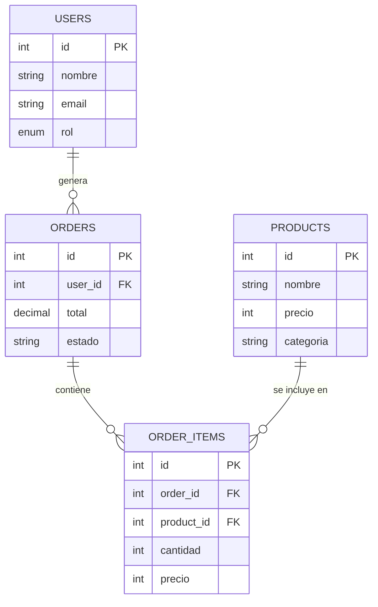

## 📊 Arquitectura de la Base de Datos

El sistema implementa una persistencia relacional en **MySQL 9.6** con el siguiente diseño lógico de entidades:

```mermaid
erDiagram
    USERS ||--o{ ORDERS : "genera"
    ORDERS ||--o{ ORDER_ITEMS : "contiene"
    PRODUCTS ||--o{ ORDER_ITEMS : "se incluye en"
    
    USERS {
        int id PK
        string nombre
        string email
        enum rol
    }
    PRODUCTS {
        int id PK
        string nombre
        int precio
        string categoria
    }
    ORDERS {
        int id PK
        int user_id FK
        decimal total
        string estado
    }
    ORDER_ITEMS {
        int id PK
        int order_id FK
        int product_id FK
        int cantidad
        int precio
    }
```

